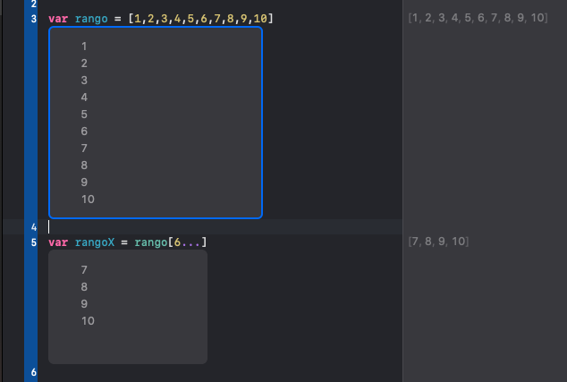

#Xcode

##Primeros pasos

### Comentarios en Xcode
🤔 El uso de los comentarios como en todos los lenguajes sirven para poner en contexto la funcion o lo que se haya declarado. 🙄

```xcode
// Soy un comentario.
/*
Soy un bloque de comentario.
*/
```

### Constantes y Variables

#### Declaracion de :

1. Constante  **let**
2. Variable	 **var**
	
##### Ejemplo

1. Constante => **_let_ Hola = "Hola Mundo"**
2. Variable => **_var_ Nombre = "Eric Avila"**

>Una **constante** es aquel espacio de memoria "apartado" que nunca cambiara su valor. 😮

>Una **variable** es aquel espacio de memoria "apartado" que recibira valores y no tendra ningun problema, en otras puede cambiar su valor.

--

### Tip de Declaracion 😎

Hay formas de escribir un nombre a una **variable** o **constante** y es que si esta compuesta por dos palabras se utiliza normalmente una forma de declaracion llamada **Camel Case**

##### Ejemplo

1. var **primerNombre** = "Eric"
2. let **cuentaBancaria** = 123456

**Camel Case** como se percibe en los dos ejemplos anteriores se aplica cuando se componen por dos palabras o "mas" y para diferenciarlas de unas y otras la primera letra se escribe en Mayuscula.

--

### Tipos de Datos

Como tal una deficinion logica no la hay, pero se puede entender que si tu haces una **operacion aritmetica** obtendras un valor **numerico** y su *tipo de dato* seria **numerico**, o en el caso de escribir tu nombre y se desea guardar en una **variable** o **constante** el *tipo de dato* mas adecuado seria **string** el cual guarda letras y numeros pero en "texto".

🙄 Podemos darnos cuenta y que quede mas claro como lo veremos enseguida

El IDE Xcode nos puede ayudar para ver el tipo de valor al que pertenece lo que acabas de declarar, por ejemplo:


Si presionamos la tecla ***ALT*** ⌥ y pasamos el cursor sobre el nombre de la variable observaremos un signo de interrogacion ❔y si damos click observaremos la descripcion del *tipo de dato* al que pertenece.


Y si presionamos sobre la palabra **String** en este caso, nos saldra todo acerca de el y podemos observar un


Asi, con cada uno de los tipos de datos que soporta el lenguaje, como los siguiente:

1. **Int**
2. **Double**
3. **String**

> Esos son los clasicos, mas adelante veremos otros tipos que existen. 🤓

--

### Operadores arimeticos + - * / 🤓

> **Nota** Al momento de hacer alguna operacion aritmetica es necesario saber el **tipo de dato** que interactuaran entre sí, no podriamos sumar un numero y una letra porque nos daria error, o sumar un *entero* ( **Int** un numero sin decimales) con un *numero con decimales* (**Double** numero con decimales)

##### Ejemplo


> **Nota** Podemos observar que al momento de pasar el cursor sobre el nombre de la variable que guardara e**tipo de dato**l operador podremos ver su *tipo de dato* 

Si quisieramos hacer una operacion con *decimales* se le asigna el tipo **Double** como en el siguiente ejemplo.


Pero eso no es todo, debemos de **parsear** los valores que estaran en la operación, se cambian los valores de **a** y **b**.


> **Nota** Lo que se debe de entender por **parsear** es la "transformación" de la variable a un *tipo de dato* especifico.

--

###Operadores Compuestos

Son aquellos operadores que nos sirve para hacer ahorrar lineas de codigo.


###Operadores de Comparación

Son aquellos operadores que se pueden interpretar como una pregunta y los cuales te dan como resultado un **boleano**


--

### Declaración Implicita y explicita 🧐

Se le llama declaración **implicita** a la interpretación del tipo de variable que le asinga el **Xcode** y la declaración **explicita** es aquella cuyo programador lo asigna al momento de declarar la variable. Y ademas el nombre de la variable haciendo referencia de que contiene, para que saber que es lo que guarda, ya sea un resultado, el nombre de un estudiante, etc..

#### Ejemplo


--

###Carateres *(Strings => Simbolos y Palabras)* y Cadenas

####String con salto de linea


Se inicia y se finaliza con **"""** y esto hara que el interprete cree un salto de linea como se lo indicamos con cada **Enter** ⏎

####String vacios

Es una tecnica para luego asignar un valor a la variable string en el momento que sea necesario.


####Caracteres


####Emojis


####Caracteres especiales
 1. **\n** => Salto de linea
 2. **\r** => Retorno de carro
 3. **\t** => Tabulacion
 4. **\0** => Caracter nullo
 5. **\'** => Representacionde las comillas


####Contatenación
Es como su nombre lo indica una union de varios **Strings**
 


####Interpolación
Es la union de texto y de variables en una cadena de texto 


O de esta manera


####Busqueda de contenido dentro de una cadena

Hay varias funciones que puedes ser utilizadas con los elementos de tipo **String**


>Si existe un contenido en especifico en la cadena o si la cadena se encuentra vacia, ya existen varias funciones que te ahorran tiempo y que pueden ser de gran ayuda.

--

###Operadores Logicos y Condiciones

Podemos obtener resultados **boleanos** ( **TRUE** , **FALSE** ) si se hace una comparacion entre dos o mas variables, los cuales con ellos podemos obtener si algo es *correcto* o *incorrecto*.

###Condicion IF / ELSE

Podemos evaluar variables y poder realizar acciones si sucede que sea cierto o en caso contrario realizar otra acción.

### IF / ELSE

>En este ejemplo observamos que se quiere comprar una Mac y la cual tiene un costo fijo y se cuenta con otra variable con "tu" dinero, el cual como es menor que el precio esta es evaluada por medio del **IF** y como no es igual a la otra cantidad se resuelve en el **ELSE**

###IF Operador AND => &&

>Aqui se utiliza una doble evaluación utilizando el **Operador AND** el cual indica que ambas condiciones se tienen que cumplir para que sea **TRUE**

###IF Operador OR  => ||


>Aqui se utilizan dos evaluaciones la primera no se cumple pero hay otra evaluacion y se une con el **Operador OR** la cual siempre y cuando se cumpla una, esta sera verdadera.

--

###SWITCH
**Switch** es una manera diferente de hacer una evaluacion en base un parametro y el cual si no corresponde con ningun caso este tiene un **default**


>Podemos poner en cada **case** un rango si evaluaramos **Integers** o un **String** si fuera texto

--

###Arreglos - Arrays
Son conjuntos de un *tipo de dato*


>En la imagen observamos un **arreglo** el cual por su "contenido" es de tipo **Integer** o sea numeros enteros, si tuviera elementos tipo **String** el **arreglo** seria de otro *tipo de dato*.


>Agrega elementos al final del **arreglo**


>Con esta funcion puedes agregar un elemento en una posicion *x*.


--
###Diccionarios


Un diccionario es una coleccion de datos que tiene una **KEY** y un **VALUE**, puede ser de cualquier *tipo de dato* y los datos se tienes que respetar. Una manera de acceder al contenido es utilizar el **KEY** ya que con el se hacen las busquedas. 


>Declarar un **Diccionario** con elementos base


>Agregar elementos


>Acceder a un dato


>Borrar un dato => **nil** = **NULL**


--

###TUPLAS

Es una coleccion de datos parecido a los **arreglos** pero con la diferencia de que aceptan varios *tipo de dato*


>Acceder a un dato


>Tuplas "nombradas"


--

###ENUM o Enumeración

Es una estructura donde se agrupan diferentes datos.

>ENUM de diferentes tipos de dato


>ENUM de un tipo String


--

###Range Operator => Operador de Rango

Es un operador que nos ayuda a obtener un rango de un arrgleo o en otro caso crear arreglos en base a las reglas del operador

>Se declara un **Array** y se obtiene cierta parte de el con el operador diciendo por medio de dos parametros que son los *indices* 


>Se declara un rango que solo se le asigna el *indice* X que para este ejemplo es el lado izquierdo.



>Se declara un rango que solo se le asigna el *indice* Y que para este ejemplo es el lado derecho.


>Tambien se puede crear un array utilizando ese operador si se **parsea** a tipo **array**.


--

###Ciclos o Bucles
